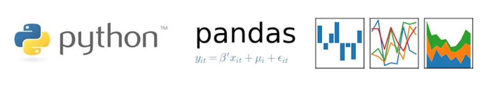

# Fundamentals of Data Analysis Assessment 2019
### Semester 2: Fundamentals of Data Analysis Module, Assessment 2019 Repository 

The notebook describes the tips dataset. The notebook is broken up in to three main sections below. In each section there are a a number of headings and sub headings. The notebook runs from top to bottom sequentially. 

In the first section we import the dataset from a URL using seaborn. Descriptive statics are plotted and discussed. From the descriptive statistics and plots conclusions are drawn. 

In the second section Linear Regression is discussed and how the variable tip is dependent on total_bill 

Finally in the third section we analyse the dataset further with a variety of plots that analyse various dataset variables together to visualise the information in the dataset. We look at filtering the dataset and how useful that can be for example filtering on days of the week or finding tips that are <= 1.00. We also look at pairplots that give us further information on multiple variables together, conclusions are also drawn from this section. 
# 1. Description
   * Importing Python Packages
   * Importing Tip Dataset 
   * Descriptive Statistics 
     * Gender Differences
   * Plotting Variables from the Dataset
     * Univariate Plots
        In this section variables such as tip, total_bill and size are plotted.
   * Conclusions

# 2. Regression
  * Linear Regression Cost
  * Minimising the Cost Calcualtion using Calculus
  * Minimising the Cost Calculation using Python Numpy Polyfit Function
  * Calculating the Cost
  * Linear Regression Using Seaborn
  * Conclusion
  
# 3. Analyse
  * Bivariate Plots
    * Bar Plots
    * Category Plots
  * Filtering the Dataset
    * Filter by String Variable
    * Filter by Numeric Value
   * Pairplots
   * Conclusions
  
